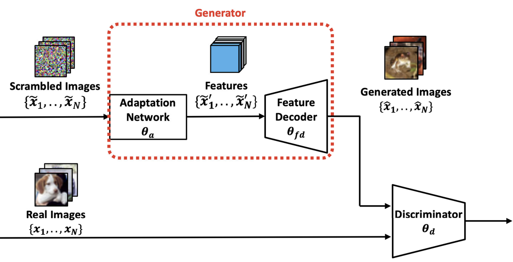
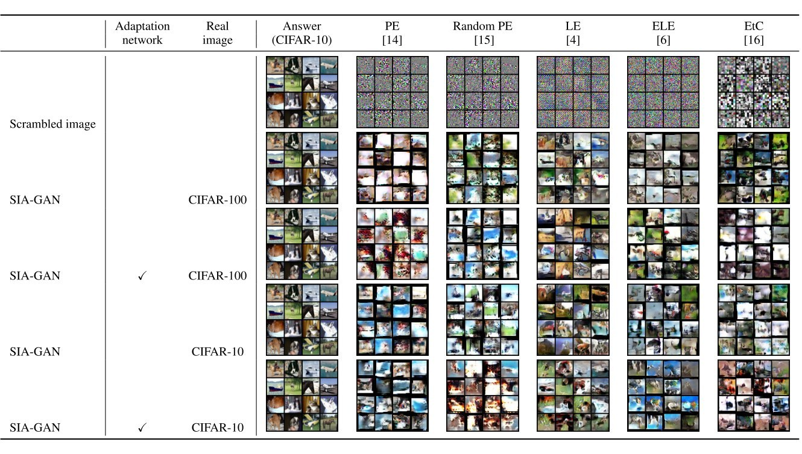

# SIA-GAN: Scrambling Inversion Attack Using Generative Adversarial Network

Code of the paper *SIA-GAN: Scrambling Inversion Attack Using Generative Adversarial Network* (IEEE Access, 2021).

[Koki Madono](https://madonokouki.github.io/)<sup>1,2</sup>, Masayuki Tanaka<sup>2,3</sup>, Masaki Onishi<sup>2</sup>, Tetsuji Ogawa<sup>1,2</sup><br>
<sup>1</sup>Waseda University, <sup>2</sup>Artificial Intelligence Research Center, National Institute of Advanced Industrial Science and Technology (AIST), <sup>3</sup>Tokyo Institute of Technology

[](https://madonokouki.github.io/projects/siagan/)
[](https://doi.org/10.1109/ACCESS.2021.3112684)
[-green)](https://ieeexplore.ieee.org/document/9537763)
[](https://github.com/MADONOKOUKI/scramblekit)
[](LICENSE)

<p align="center"></p>

**TL;DR** Image scrambling (pixel-based encryption, learnable encryption, EtC, …) is used to hide the content of
images sent to an untrusted cloud for training and inference. SIA-GAN measures how much a scrambler really hides. An
attacker who intercepts scrambled images and collects real images of the same classes trains a GAN whose generator
(an adaptation network + a feature decoder) learns to invert the scrambling. The attack recovers the structure of
images scrambled without block shuffling (PE, random PE, LE). With block shuffling (ELE, EtC) the recovered images
look natural but do not show the original content, so **block shuffling is what makes scrambled images robust**.

## Use it: `pip install scramblekit`

SIA-GAN is part of [**scramblekit**](https://github.com/MADONOKOUKI/scramblekit), the maintained library of the
image-scrambling papers of this series (scramblers, adaptation networks, scrambling parameter generation, SIA-GAN and
ScrambleMix):

```bash
pip install "scramblekit[all]"
scramblekit attack --dataset cifar10 --real-dataset cifar100 --scheme le --key paper --out runs/siagan_le
```

```python
from scramblekit.attack import SIAGAN
from scramblekit.scramble import LE

attack = SIAGAN(num_classes=10)                              # adaptation network + feature decoder vs. discriminator
attack.fit(train_loader, scrambler=LE("paper"), epochs=100)  # train_loader: (image, label) batches, e.g. CIFAR-10
print(attack.evaluate(test_loader, LE("paper")))             # PSNR / SSIM / LPIPS of the recovered images
```

`--scheme` selects the attacked scrambler (`pe`, `randompe`, `le`, `ele`, `etc`, …), `--key paper` uses the keys
of the original experiments (the `key4/` files of this repository), and `--dataset fake` runs a quick smoke test
without downloading data. See the [scramblekit documentation of the attack](https://github.com/MADONOKOUKI/scramblekit/blob/main/docs/attack.md),
which also lists where the library follows this code and where it follows the paper.

## Results

LPIPS between the original CIFAR-10 image and the scrambled image (first row) or the image generated by SIA-GAN
(other rows), with and without the adaptation network in the generator and with real images from a different
(CIFAR-100) or the same (CIFAR-10) dataset. Values from Table 3 of the paper.

| Input | Adaptation network | Real images | PE | Random PE | LE | ELE | EtC |
|---|:---:|---|---:|---:|---:|---:|---:|
| Scrambled image | | | 0.3255 | 0.3231 | 0.3035 | 0.2947 | 0.2074 |
| SIA-GAN output | | different (CIFAR-100) | 0.1845 | 0.1954 | 0.1069 | 0.1589 | 0.2628 |
| SIA-GAN output | ✓ | different (CIFAR-100) | 0.1632 | 0.1960 | 0.1565 | 0.1483 | 0.2116 |
| SIA-GAN output | | same (CIFAR-10) | 0.1964 | 0.1509 | 0.1451 | 0.1897 | 0.2067 |
| SIA-GAN output | ✓ | same (CIFAR-10) | 0.1719 | 0.1559 | 0.0914 | 0.1512 | 0.2090 |



*Images generated by SIA-GAN from scrambled CIFAR-10 images (Table 2 of the paper; CC BY 4.0). The "Answer" column
is the original. PE, random PE and LE are inverted; for ELE and EtC, which shuffle block positions, the generated
images do not match the originals.*

## Original experiment code

The Python scripts at the top level of this repository are the research code used for the paper, kept as they
were (PyTorch of 2020, job scripts for the ABCI cluster, not maintained). The main entry points are:

| Script | Purpose |
|---|---|
| `gan_attack.py`, `gan_attack_alpha_*.py`, `gan_attack_sameimg.py` | SIA-GAN attack variants (generator: `generator.py`; spectral-norm discriminator: `dcgan_spec_acgan.py`) |
| `tanaka_cifar10_LE*.py` | classification of scrambled CIFAR-10 images with the adaptation network (`tanaka_adaptation_network.py`) |
| `learnable_encryption.py`, `Blockwise_scramble_LE.py` | learnable (block-wise) image encryption |
| `key4/` | the scrambling keys of the experiments (also loaded by `scramblekit` as `key="paper"`) |
| `*.sh` | the cluster job scripts that ran them |

For new work, use scramblekit (above). It reimplements the attack with the architecture of Tables 4–6 of the paper and the training setup of this code, and its documentation lists every difference.

## Citation

If you find this work useful, please cite:

```bibtex
@article{madono2021siagan,
  title   = {{SIA-GAN}: Scrambling Inversion Attack Using Generative Adversarial Network},
  author  = {Madono, Koki and Tanaka, Masayuki and Onishi, Masaki and Ogawa, Tetsuji},
  journal = {IEEE Access},
  volume  = {9},
  pages   = {129385--129393},
  year    = {2021},
  doi     = {10.1109/ACCESS.2021.3112684}
}
```

GitHub's "Cite this repository" button (from [`CITATION.cff`](CITATION.cff)) gives the same reference.

## Related projects

- Block-wise Scrambled Image Recognition Using Adaptation Network (AAAI WS 2020) — https://github.com/MADONOKOUKI/Block-wise-Scrambled-Image-Recognition
- Scrambling Parameter Generation to Improve Perceptual Information Hiding (EI 2021) — https://github.com/MADONOKOUKI/SPG_EI2020
- ScrambleMix: A Privacy-Preserving Image Processing for Edge-Cloud Machine Learning (PSIVT 2023) — https://github.com/MADONOKOUKI/psivt23_scramblemix
- Instance-wise Center Loss for Efficient Training of Deep CNNs (GCCE 2022) — https://github.com/MADONOKOUKI/gcce2022_instancewise_center_loss

## Acknowledgements

This work was supported by JST CREST Grant Number JPMJCR19F5.

## License

MIT License. See [LICENSE](LICENSE). The figures in `assets/` are from the open-access paper (CC BY 4.0).
