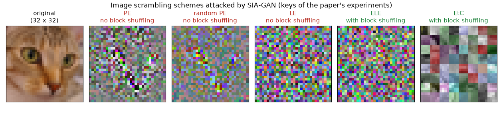

# SIA-GAN: Scrambling Inversion Attack Using Generative Adversarial Network

Official PyTorch implementation of the paper *SIA-GAN: Scrambling Inversion Attack Using Generative Adversarial Network* (IEEE Access, 2021).

[Koki Madono](https://madonokouki.github.io/)<sup>1,2</sup>, Masayuki Tanaka<sup>2,3</sup>, Masaki Onishi<sup>2</sup>, Tetsuji Ogawa<sup>1,2</sup><br>
<sup>1</sup>Waseda University &nbsp; <sup>2</sup>Artificial Intelligence Research Center, National Institute of Advanced Industrial Science and Technology (AIST) &nbsp; <sup>3</sup>Tokyo Institute of Technology

[](https://madonokouki.github.io/projects/siagan/)
[](https://doi.org/10.1109/ACCESS.2021.3112684)
[-blue)](https://ieeexplore.ieee.org/document/9537763)
[](LICENSE)
[](https://www.python.org/)
[](https://pytorch.org/)
[](https://github.com/MADONOKOUKI/SIA-GAN/actions/workflows/tests.yml)
[](https://colab.research.google.com/github/MADONOKOUKI/SIA-GAN/blob/main/notebooks/quickstart.ipynb)

<p align="center"></p>

**TL;DR** Image scrambling (pixel-based encryption, learnable encryption, EtC, ...) hides the content of images
that are sent to an untrusted cloud for training and inference. SIA-GAN measures how much a scrambler really
hides: an attacker who intercepts scrambled images with their labels and collects natural images of a similar
domain trains a GAN whose generator (an adaptation network + a feature decoder) learns to invert the scrambling
without the key. The attack recovers the structure of images scrambled without block shuffling (PE, random PE,
LE); with block shuffling (ELE, EtC) the generated images look natural but do not show the original content, so
**block shuffling is what makes scrambled images robust**.

## News

- 2026-10: Code refactored into an installable package with a Colab quick start; the original research code is kept in [archive/](archive/).

## Installation

```bash
git clone --depth 1 https://github.com/MADONOKOUKI/SIA-GAN
cd SIA-GAN
pip install -e .                # add ".[examples]" for the quick-start figure (matplotlib, scikit-image)
```

or install only the library (`import siagan`):

```bash
pip install git+https://github.com/MADONOKOUKI/SIA-GAN
```

## Quick start

```python
import torch, siagan

le = siagan.LE()                              # learnable encryption with the key of the paper's experiments
x = torch.rand(8, 3, 32, 32)                  # images in [0, 1]; PIL images and numpy arrays work too
x_scr = le(x)                                 # what the attacker intercepts (siagan.PE / RandomPE / ELE / EtC too)

attack = siagan.SIAGAN(num_classes=10)        # adaptation network + feature decoder vs. discriminator, paper settings
attack.fit(train_loader, le, epochs=100)      # train_loader: (image, label) batches, e.g. CIFAR-10 with ToTensor()
recovered = attack.reconstruct(x_scr)         # G(scrambled): the attacker's estimate of x, in [0, 1]
print(attack.evaluate(test_loader, le))       # PSNR / SSIM / LPIPS of the scrambled and the recovered images
```

`python examples/quickstart.py` (a few seconds on a CPU, no downloads) scrambles an image with the five schemes
attacked in the paper and runs a few SIA-GAN training steps, an inversion and an evaluation on synthetic data. It
writes this figure:



| scheme (Table 1) | class | operation | block shuffling |
|---|---|---|:---:|
| PE (Sirichotedumrong et al. 2019) | `siagan.PE()` | negative-positive transform and colour shuffling of individual pixels, one key | |
| random PE (Sirichotedumrong et al. 2019) | `siagan.RandomPE()` | negative-positive transform of half of the values, a new key for every image | |
| LE (Tanaka 2018) | `siagan.LE()` | pixel shuffling and negative-positive transform of 4-bit values, one key for all 4x4 blocks | |
| ELE (Madono et al. 2020) | `siagan.ELE()` | LE with a different key per block | ✓ |
| EtC (Chuman et al. 2018) | `siagan.EtC()` | block rotation, inversion, negative-positive transform and colour shuffling per block | ✓ |

Every scheme accepts PIL images, numpy arrays (`H x W x C`, `uint8` or float) and tensors (`C x H x W` /
`N x C x H x W`), so it can be used as a torchvision transform. `key="paper"` (the default) uses the keys of the
original experiments and an integer seed draws a new key, e.g. `siagan.ELE(key=1)`; `siagan.BlockShuffle()` is
block shuffling alone. For PE and random PE use `siagan.SIAGAN(block_size=1)` (1 x 1 blocks in the
adaptation network, Sec. V). The networks are ordinary modules: `siagan.Generator` (= `AdaptationNetwork` +
`FeatureDecoder`, Tables 4-5, Fig. 5) and `siagan.Discriminator` (Table 6), with the hinge losses
`siagan.discriminator_hinge_loss` / `siagan.generator_hinge_loss` (Eqs. 3-4).

## Reproducing the paper

One script replaces the attack scripts of the original code. One run = one cell of Table 3 and one column of Table 2:

```bash
python attack.py --scheme {pe,randompe,le,ele,etc} --real-dataset {cifar10,cifar100} [--no-adaptation]
# e.g. LE, generator with the adaptation network, real images from CIFAR-100 ("Diff."):
python attack.py --scheme le --real-dataset cifar100
```

CIFAR-10/100 are downloaded to `--data-root` (default `./data`). Each run writes to
`runs/cifar10_<scheme>_<same|cifar100>_<adapt|noadapt>/`: `history.csv` (losses per epoch), `last.pt` (checkpoint;
`--resume` continues from it), `metrics.json` and `samples.png` (original / scrambled / recovered test images, as
in Table 2). In `metrics.json`, `test.reconstructed.lpips` is the Table 3 cell and `test.scrambled.lpips` the
"Scrambled image" row (`--epochs 0` computes the latter without training). The LPIPS is evaluated on the 10,000
CIFAR-10 test images after the last epoch. [`scripts/reproduce_table3.sh`](scripts/reproduce_table3.sh) lists the
20 runs of Table 3, grouped by table row. For a quick check without any download:

```bash
python attack.py --dataset fake --epochs 1 --batch-size 8 --ndf 64 --classifier none --no-lpips
```

Defaults are the settings of the paper (Sec. V-A) and, where the paper says nothing or disagrees with the code,
those of the original code:

| setting | default | source |
|---|---|---|
| scrambled images | the 50,000 CIFAR-10 training images; random crop (padding 4) and horizontal flip before scrambling | paper (augmentation before scrambling), code (`gan_attack.py`) |
| real images | `--real-dataset cifar10` ("Same"): the first half of every CIFAR-10 batch, the second half is scrambled; `cifar100` ("Diff."): CIFAR-100 training images | paper, code |
| mini-batch / epochs | 64 / 100 | paper |
| optimiser | Adam, β = (0, 0.9), learning rate 1e-4 (generator) and 4e-4 (discriminator) | paper |
| losses | hinge loss (Eqs. 3-4) + cross entropy of a ShakeDrop PyramidNet-110 (α = 270) trained on the generated images (weight 1) | paper + code |
| adaptation network | one sub-network per 4 x 4 block (LE, ELE, EtC) or per pixel (PE, random PE) | paper (Sec. V, Table 4) |
| keys | LE: `key4/0_.pkl`; ELE: `key4/0..63_.pkl` + block order of `random.seed(30)`; EtC: `random.seed(30)`; PE: see notes; random PE: a new key per image | code |
| evaluation | LPIPS (AlexNet, images in [0, 1] passed without `normalize`), PSNR, SSIM | paper (Table 3), code |

Each run trains for 100 epochs of 782 steps with a 1.09M-parameter generator (0.35M with 1 x 1 blocks), a
13.36M-parameter discriminator and a 28.49M-parameter classifier (the classifier of the code), so a CUDA GPU is
needed. On an Apple M2 GPU (MPS) one step took about 2.7 s in our measurement (`--dataset fake --fake-size 1280
--epochs 2 --device mps`: 53.8 s for the 20 steps of the second epoch), i.e. roughly 2.4 days per run. CPU and
Apple-silicon devices are fine for the quick start and the smoke test. We have not re-run the 100-epoch trainings
with the refactored code; the tests check that it reproduces the outputs of the original code
([`tests/test_parity_original.py`](tests/test_parity_original.py)).

<details>
<summary><b>Notes on faithfulness: where the original code differs from the paper text</b></summary>

The new code follows the original code, which produced the numbers in the paper. Where the code exists in
variants that disagree with each other, the paper's setting is used. These are the same decisions as in the
scramblekit library, whose scramblers give bit-identical outputs
([`tests/test_scramblekit_parity.py`](tests/test_scramblekit_parity.py)).

- **Generator loss:** Eq. 1 lists only the adversarial loss. The code adds the cross entropy of a ShakeDrop
  PyramidNet-110 classifier that is trained jointly on the generated images (updated by the generator's
  optimiser). Kept by default; `--classifier none` gives the paper's loss.
- **Optimiser, mini-batch, epochs:** the code variants differ from each other and from the paper
  (`gan_attack.py`: Adam 2e-4 for both networks, β = (0.9, 0.999) / (0.5, 0.999), batch 256 split into
  real/scrambled halves, 100 epochs; `gan_attack_alpha_10.py`: 1e-4 with β = (0.5, 0.9) / 4e-4 with (0, 0.9),
  256 + 256 images, 75 epochs). The defaults follow the paper; with the "Same" rows each batch of 64 is split into
  32 real and 32 scrambled images, as the code splits its batches.
- **Augmentation:** `gan_attack.py` uses random crop and flip, `gan_attack_alpha_10.py` flip only. We use crop and flip.
- **Extra terms of code variants** (off by default): the feature total-variation term `1e-3 * TV(feature)` of
  `gan_attack_alpha_10.py` (`--lambda-tv 1e-3`) and mixup of the scrambled inputs of `gan_attack.py`
  (`--mixup-alpha 1`).
- **Spectral normalisation of the discriminator:** the code divides the weights *in place* before every forward
  pass by the estimate of one power iteration that always starts from the same random vector
  (`siagan.InplaceSpectralNorm`; `--discriminator-sn torch` uses `torch.nn.utils.spectral_norm`). The generator
  uses `torch.nn.utils.spectral_norm`, as in the code.
- **Architecture:** Table 5 lists BatchNorm before the final Tanh and Table 6 a LeakyReLU after the convolution to
  1024 channels; the code has neither (followed here). The discriminator's AC-GAN class heads are computed by
  the code but never used and are left out. The 64 block-wise sub-networks are computed in one batched layer
  that the tests check against the per-block modules of the code.
- **Without adaptation network:** Tables 2-3 have rows without it but the released code does not; our reading
  (`--no-adaptation`) feeds the scrambled image straight into the feature decoder.
- **1 x 1 blocks for PE and random PE:** as in the paper (Sec. V). The released generator only has 4 x 4 blocks.
- **Random PE:** `random_mask` of the code inverts exactly half of the 3,072 values of every image at positions
  drawn for every image, without the colour shuffling that Table 1 lists (`siagan.RandomPE(channel_shuffle=True)`
  adds it).
- **PE, ELE and EtC:** the released code implements LE and random PE only. ELE and EtC come from the authors'
  block-wise scrambling code, whose EtC `channel_change` duplicates colour channels (reproduced by default;
  `--channel-mode permutation` is the intended colour permutation). PE comes from the authors' ScrambleMix code;
  the PE keys of the SIA-GAN experiments are not in the released code, so `siagan.PE()` uses the first CIFAR-10
  key of the ScrambleMix code (`siagan.paper_pe_key()`).
- **Keys of LE and ELE:** the 64 key files `key4/0_.pkl` ... `key4/63_.pkl` of the original code ship with the
  package (`siagan.paper_keys()`); the files themselves are in [`archive/key4/`](archive/key4/). The attack
  scripts scramble with `key4/0_.pkl`.
- **LPIPS:** the original evaluation passes images in [0, 1] to `lpips.LPIPS(net='alex')` without
  `normalize=True` (the network expects [-1, 1]); `siagan.LPIPS` and `SIAGAN.evaluate` do the same so that the
  numbers are comparable with Table 3 (`--lpips-normalize` rescales).
- **Which epoch:** the code printed the test LPIPS after every epoch (`--eval-every 1`); the paper does not say
  which epoch Table 3 reports. `metrics.json` holds the values after the last epoch.

</details>

## Results

LPIPS between the original CIFAR-10 test images and the scrambled images (first row) or the images generated by
SIA-GAN (other rows), with and without the adaptation network in the generator and with real images from a
different (CIFAR-100) or the same (CIFAR-10) dataset (Table 3 of the paper). Lower LPIPS of the generated images
means a more successful attack; **bold** is the lowest LPIPS of the SIA-GAN rows for each scheme.

| Input | Adaptation network | Real images | PE | Random PE | LE | ELE | EtC |
|---|:---:|---|---:|---:|---:|---:|---:|
| Scrambled image | | | 0.3255 | 0.3231 | 0.3035 | 0.2947 | 0.2074 |
| SIA-GAN output | | different (CIFAR-100) | 0.1845 | 0.1954 | 0.1069 | 0.1589 | 0.2628 |
| SIA-GAN output | ✓ | different (CIFAR-100) | **0.1632** | 0.1960 | 0.1565 | **0.1483** | 0.2116 |
| SIA-GAN output | | same (CIFAR-10) | 0.1964 | **0.1509** | 0.1451 | 0.1897 | **0.2067** |
| SIA-GAN output | ✓ | same (CIFAR-10) | 0.1719 | 0.1559 | **0.0914** | 0.1512 | 0.2090 |

`--scheme` selects the column, `--no-adaptation` and `--real-dataset` the row.


*Images generated by SIA-GAN from scrambled CIFAR-10 images (Table 2 of the paper; CC BY 4.0). The "Answer" column
shows the originals. According to the paper (Sec. V-A2), SIA-GAN recovers the structure of the images scrambled
without block shuffling (PE, random PE, LE), whereas the images scrambled with block shuffling (ELE, EtC) cannot be
converted back.*

## Repository structure

```
siagan/                   the library
  scrambling.py           PE, RandomPE, LE, ELE, EtC, BlockShuffle (PIL / numpy / torch), paper keys
  networks.py             AdaptationNetwork, FeatureDecoder, Generator, Discriminator, spectral normalisation
  classifier.py           ShakeDrop PyramidNet (the classifier term of the original code)
  losses.py               hinge losses (Eqs. 3-4), feature total variation
  trainer.py              SIAGAN: fit, train_step, reconstruct, evaluate, save / load
  metrics.py              PSNR, SSIM, LPIPS
  resources/paper_keys.npz  the 64 LE/ELE keys of the original experiments and the PE key
attack.py                 training + evaluation for every cell of Table 3
scripts/reproduce_table3.sh
examples/quickstart.py    writes assets/quickstart.png
notebooks/quickstart.ipynb
tests/                    pytest (incl. parity tests against archive/ and scramblekit)
archive/                  original research code (unmaintained), its key files and a map to the new commands
```

The original research code (PyTorch of 2020, job scripts for the ABCI cluster) is kept unchanged in
[archive/](archive/); [archive/README.md](archive/README.md) maps the old scripts to the new commands.

## Citation

If you find this work useful, please cite:

```bibtex
@article{madono2021siagan,
  title   = {{SIA-GAN}: Scrambling Inversion Attack Using Generative Adversarial Network},
  author  = {Madono, Koki and Tanaka, Masayuki and Onishi, Masaki and Ogawa, Tetsuji},
  journal = {IEEE Access},
  volume  = {9},
  pages   = {129385--129393},
  year    = {2021},
  doi     = {10.1109/ACCESS.2021.3112684}
}
```

GitHub's "Cite this repository" button (from [`CITATION.cff`](CITATION.cff)) gives the same reference.

## Related projects

- Block-wise Scrambled Image Recognition Using Adaptation Network (AAAI WS 2020) — https://github.com/MADONOKOUKI/Block-wise-Scrambled-Image-Recognition
- Scrambling Parameter Generation to Improve Perceptual Information Hiding (EI 2021) — https://github.com/MADONOKOUKI/SPG_EI2020
- ScrambleMix: A Privacy-Preserving Image Processing for Edge-Cloud Machine Learning (PSIVT 2023) — https://github.com/MADONOKOUKI/psivt23_scramblemix
- Instance-wise Center Loss for Efficient Training of Deep CNNs (GCCE 2022) — https://github.com/MADONOKOUKI/gcce2022_instancewise_center_loss

**Integrated toolkit:** `pip install scramblekit` — https://github.com/MADONOKOUKI/scramblekit (the maintained
library that bundles block-wise scrambling/LE/ELE/EtC, adaptation networks, SPG, SIA-GAN and ScrambleMix).

## Acknowledgements

This work was supported by JST CREST Grant Number JPMJCR19F5. The implementation builds on the following
reference code:

- [mastnk/ICCE-TW2018](https://github.com/mastnk/ICCE-TW2018): learnable image encryption (LE)
- [owruby/shake-drop_pytorch](https://github.com/owruby/shake-drop_pytorch): ShakeDrop and Shake-PyramidNet
- [facebookresearch/mixup-cifar10](https://github.com/facebookresearch/mixup-cifar10): mixup
- [utkuozbulak/pytorch-cnn-visualizations](https://github.com/utkuozbulak/pytorch-cnn-visualizations/blob/master/src/inverted_representation.py): total-variation norm
- Self-attention of SAGAN (Zhang et al. 2018) and spectral normalisation of SN-GAN (Miyato et al. 2018), refs. [25] and [23] of the paper

## License

MIT License. See [LICENSE](LICENSE). The figures `assets/siagan_overview.png` and `assets/siagan_results.jpg` are
from the open-access paper (CC BY 4.0).
